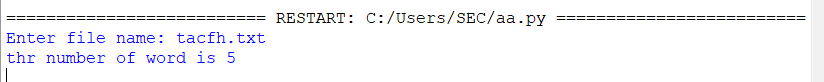

# Word-count
## AIM:
To write a python program for getting the word count from a text.
## EQUIPEMENT'S REQUIRED: 
PC
Anaconda - Python 3.7
## ALGORITHM: 
### Step 1:

### Step 2: 
 
### Step 3: 

### Step 4:  

### Step 5: 

### Step 6: 

## PROGRAM:
```
fname = input("Enter file name: ")
 
num_words = 0
 
with open(fname, 'r') as f:
    for line in f:
        words = line.split()
        num_words += len(words)
print("Number of words:")
print(num_words)
```

### OUTPUT:



## RESULT:
Thus the program is written to find the word count from a text.
